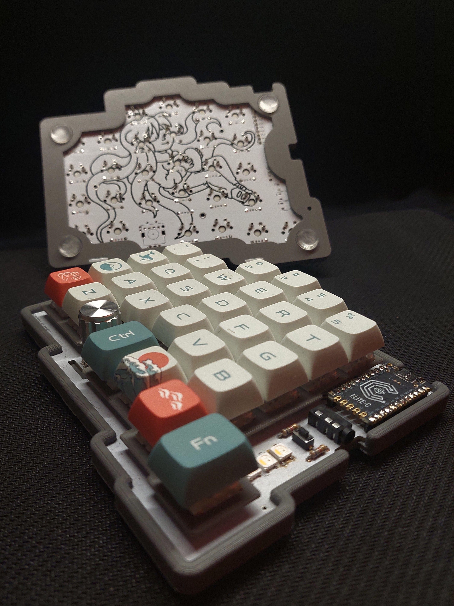
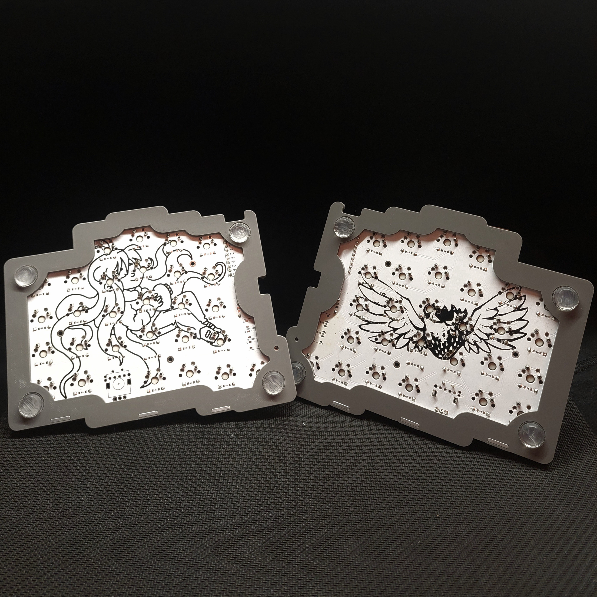

# monkey_typing/v1
<p align="center">


</p>

This is the QMK firmware repository for the monkey_typing/v1 split
ergonomic keyboard.
For the PCB and build instructions, please refer to the
[hardware repository](https://github.com/arrowtip/monkey-typing_v1).

## Flashing of Firmware
First set up your local QMK environment 
([tutorial](https://docs.qmk.fm/#/getting_started_build_tools)).

Then run
```bash
$ qmk flash -kb monkey_typing/v1 -km arrowtip
```
To put the keyboard into bootloader mode, press the reset button underneath
the TRRS jack.

> [!CAUTION]
> Never plug the TRRS cable in or out while the keyboard is connected via USB!
